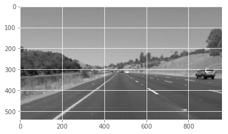
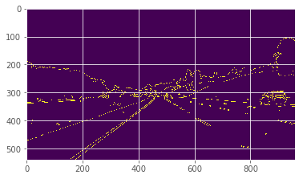
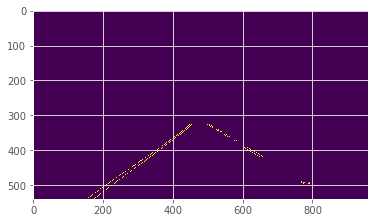
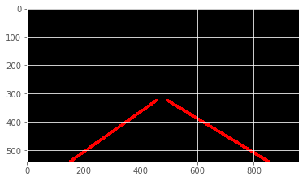
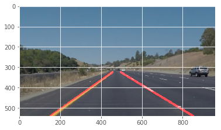
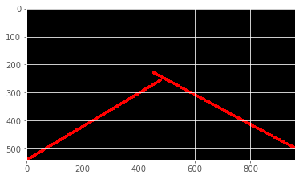

# Objective

Implement an image processing pipeline to identify and draw lane lines.

# Pipeline

## Breakdown and visualization 

A cumulitively graphed imaged for each step was added to give a more intuitive vizualization of the pipeline, as well as tuning individual functional parameters.

### Preprocess data

The objective of this step was to optimize the data for processing. 

- Dimensionality reduction was used to remove redundant processing. 

- Gradient smoothing was applied to reduce noise. 

These where achieved by applying cv2.cvtColor() and cv2.GaussianBlur(), respectively. 

### Edge detection

The purpose of this step was to perform feature extraction.  

Clearly, lane lines are lines, and have linear edges. Thus, canny edge detection was applied per suggestion, and by method of cv2.Canny(). 

### Mask

A mask is necessary for utilitizing hough transform in this case. This is explored in the following section: 2.2 Hough transform without mask. 

Using an edge detected image as input, the mask was hardcoded to a region of interest.    

### Hough transform with mask 

Applying the hough transform to our region of interest returns a pretty good representation. 

### Draw lines 

The last step applies a draw lines function, which will be explored further in 2.3 Modifying draw_lines().   

## Non-Pipeline Supplement 
### Hough transform without mask 

Hough transform is applied accross all points. Therefore, without a region of interest, it's difficult to utilize efficiently in this instance. 

Below is a visualization of a hough transform applied across the entire image space.

# Modifying draw_lines()

A good draw lines function was defined by: 

1. Relatively smooth.
2. Continuous
2. Marginalized with the lower border.

An average line was satisfactory in achieving smoothness and continuity. However, in order to marginalize with the lower border, more work was required. 

It was determined that the necessary x and y values required to simply draw a line to the border could be solved for given the following:

- For each lane, the slope and y-intercept can determined by using an average line calculated from output of the hough transform. 

- The y value of the lower margin is equivilant to the height of the image. 

**The x value of the line at the lower margin can be found by:**

Starting the two average points, the slope can be determined by: $ m = \frac{y_1 - y_2}{x_1 - x_2} $

With m and our two points,  the y-intercept can be determined by: $ b = y - mx$

With m, b, and any given y value, a corresponding x can be determined by: $x = \frac{y - b}{m} $ 

# Shortcomings and improvements

## Consistant line height.

A shortcoming was applying a consistant upper threshold.

I wanted to try something like:

y_upper_threshold = img.shape[0] * 0.55 

Then replace or average it with the y-values of the center points, however it wasn't plug and play. I decided I had enough fun on this project already. 

## Curved lines

An improvement would be to actually curve the draw lines to curved lines. 

## Determine line type (double yellow, broken white, etc). Color code draw_lines()

An improvement would be to draw a different line color for each type of line, though this is more computer vision. 

## Motorcyle input data. 

With a consistant camera position, this works fine. However, a variation on the roll axis would break the mask functionality. 
